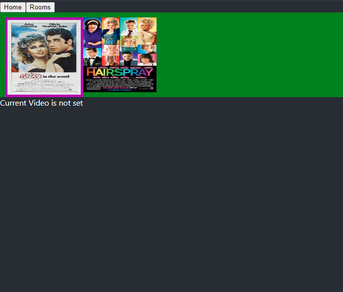
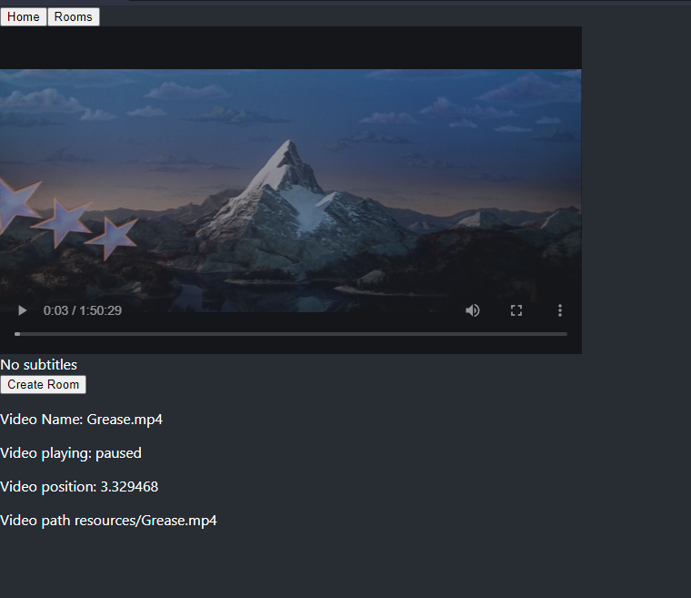
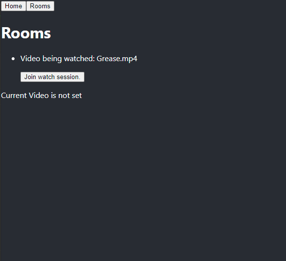

# React-experiment-video-player

A react based single page app that has a video selection screen, video player and a group watch feature using web sockets. 

The API server is run using NodeJS and checks the host machine for valid video videos, subtitles and an associated thumbnail and serves it to the react frontend. It hosts REST based APIs to allow for the retrieval of the video, thumbnails and subtitles and it uses websockets to sync up a 'group watch' (called room) session. 


Video Selection & Video player screens: 

 

Room selection screen:



Videos, thumbnails and subtitles are currently discoverable with this folder format

```
backend
│   README.md
│   builders
|   constants
|   ...
│
└───thumbnails
│   │   videoExample1.jpg
│   │   videoExample2.jpg
└───videos
    │   videoExample1.mp4/m4v
    │   videoExample2.mp4/m4v
    |   videoExample2.vtt   (subtitle file)
```


# Building
Building the backend server: [Building the API server](./backend/README.md)
</br>
Building the frontend react app: [Building the Client](./frontend/README.md)

## Current progress 

```
Note: This code is currently being refactored for a refactoring guide I'm writing, with SOLID and TDD in mind. 
The intent is to refactor and add acceptance criteria before adding new features (as listed below) 
```
- [ ] CI/CD through Jenkins 
    - [x] Building API/backend
    - [ ] Testing API/backend
        - [x] Unit tests
        - [ ] API tests
    - [x] Building Client/frontend
    - [ ] Testing API/backend
    - [ ] Full scale 'prod-like' end-to-end testing
    - [ ] Add a build status badge to the top level readme
- [x] Rest APIs for locating and serving content
    - [x] Videos
    - [x] Thumbnails
    - [x] Subtitles
      - [ ] Read subtitles on subtitle builder (it regressed)
      - [ ] Add API test to prevent regression.
    - [ ] Make Thumbnail discovery do a deeper search and pick the highest evaluated match (instead of just accepting the first over the threashold)
- [x] Video selection screen 
- [x] Video player screen
    - [ ] Custom styling
- [x] Room selection screen (for group watch)
    - [x] On joining, video playes from the current watching position of everyone else in the room
    - [x] Pause/play and video position changes are broadcast to everyone in the room.
    - [ ] Leave room/close socket
    - [ ] Show how many users are currently watching the video
    - [ ] Add ability for a private group watch, randomised 'password' key. 
    - [ ] Create room should pass a 'resource id' and the other client should retrieve the resource from the videoAPI rather than funneling through the socket. 
- [ ] Rescan host directories for updated content 
- [ ] Clean up disconnected socket connections
- [ ] Reassign 'host' when the host leaves (the socket who's videos state is grabbed when a new user joins the room)
- [x] Add a nginx.conf file
  - [ ] Add certificate, using certbot.
- [ ] Add CORS ? 
- [x] Dockerise frontend
  - [ ] Narrow down files that should be in the docker image.
- [x] Dockerise backend
  - [ ] Narrow down files that should be in the docker image.
- [x] Add docker-compose.yml
- [x] create environment variables for the location of static content, thumbnails, videos and subtitles
  - [x] wire changeable static content path into client
  - [x] add to compose.
- [ ] Ensure excessive or missing '/' from configuration is handled correctly. 
- [x] Customise websocket path by configuration.

## Jenkins CI/CD support
It has Jenkins support, If you have a Jenkins server you can use the Jenkins github plugin to set up a job. It's much easier through blue-ocean. You can create a new pipeline, point it at your github repository and it will automatically build your project.
